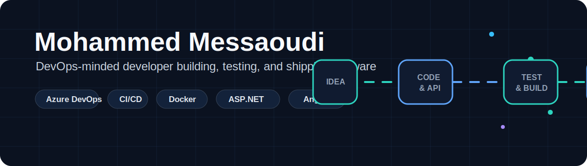
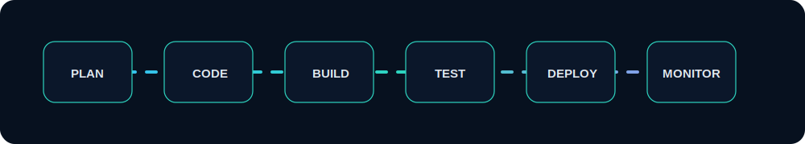
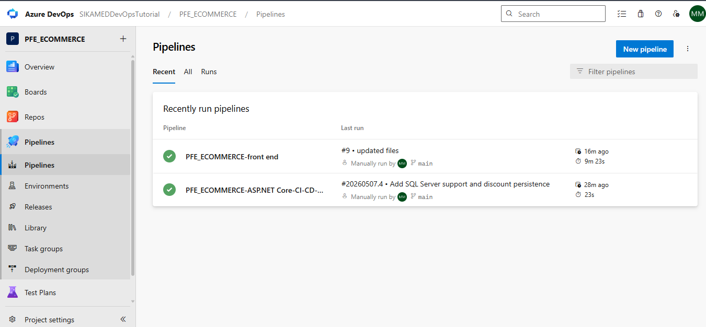
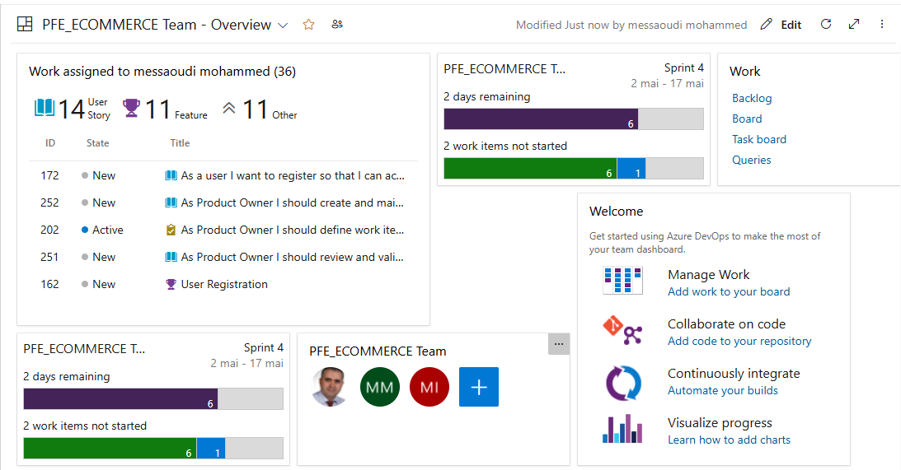
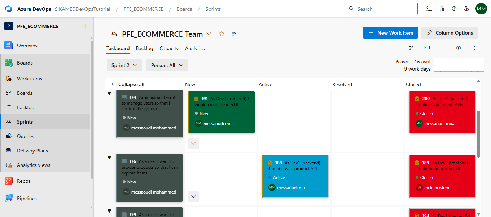
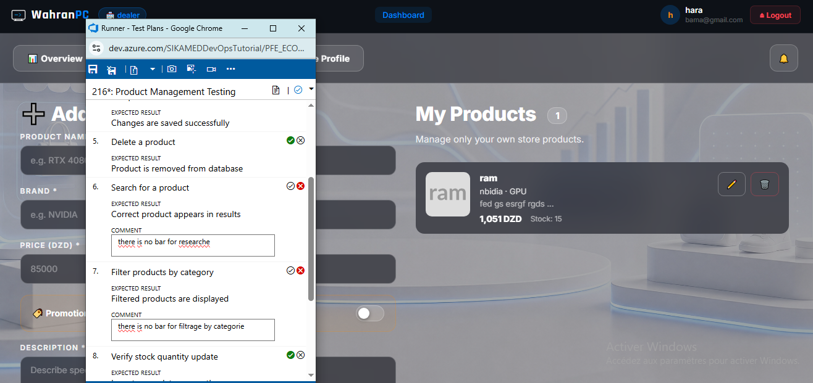

<p align="center">
  
</p>

<p align="center">
  <a href="https://portfolio-three-azure-lhhzp87oz9.vercel.app">
    
  </a>
  <a href="https://www.linkedin.com/in/mohammed-messaoudi-32959b38b">
    
  </a>
  <a href="https://github.com/medmess">
    
  </a>
</p>

<p align="center">
  
</p>

## Hey, I'm Mohammed

I'm a Computer Science graduate based in Almere, Netherlands, focused mainly on DevOps, cloud, CI/CD, and infrastructure delivery.

I studied in Oran, Algeria at USTO University, specializing in ISIL: Ingenierie des Systemes et de Logiciels.

DevOps is the area I care about the most and the one I want to grow in professionally. I like connecting the full delivery chain: planning the work, managing code, testing features, building pipelines, and preparing software for deployment.

In my ecommerce graduation project, I worked as product owner, tester, frontend developer, and backend developer, but the strongest part of the story is the DevOps workflow around it: Azure Boards, Azure Repos, Azure Pipelines, sprint tracking, and test execution.

## DevOps First

<p align="center">
  
</p>

```text
requirements -> backlog -> repo -> pipeline -> tests -> release -> monitoring -> improvement
```

- Azure DevOps for boards, repos, pipelines, test plans, and project delivery
- CI/CD thinking: build automation, release readiness, and fast feedback
- Containers and cloud: Docker, Kubernetes fundamentals, Azure ecosystem
- Testing culture: validating real user flows before calling a feature done
- Full-stack awareness: frontend and backend experience that helps me understand what the pipeline is shipping

## DevOps Toolbox

<p>
  
  
  
  
  
  
  
  
  
  
  
  
</p>

## Azure DevOps Project Proof

### PFE Ecommerce Platform

This is the project that best shows my DevOps mindset. I did product ownership, testing, frontend, and backend work, but I also used Azure DevOps to keep the work organized and visible from planning to delivery.

| DevOps area | What I handled |
| --- | --- |
| Planning | User stories, backlog items, sprint work, feature validation |
| Source control | Azure Repos for frontend and backend code |
| CI/CD | Azure Pipelines for build and delivery workflow |
| Testing | Azure Test Plans, manual execution, bug/feedback tracking |
| Delivery | Connecting product, code, tests, and release readiness |

<p align="center">
  
  
</p>

<p align="center">
  
  
</p>

## Repositories To Check First

<table>
  <tr>
    <td width="50%">
      <a href="https://github.com/medmess/pfe-ecom-backend"><strong>pfe-ecom-backend</strong></a>
      <br>
      ASP.NET Core ecommerce backend connected to the DevOps workflow: source control, testing, and pipeline-ready delivery.
    </td>
    <td width="50%">
      <a href="https://github.com/medmess/pfe-ecom-frontend"><strong>pfe-ecom-frontend</strong></a>
      <br>
      Angular ecommerce frontend developed as part of the same Azure DevOps delivery flow.
    </td>
  </tr>
  <tr>
    <td width="50%">
      <a href="https://github.com/medmess/lost-and-found-web-app-plateforme-"><strong>lost-and-found-web-app-plateforme-</strong></a>
      <br>
      TypeScript web platform showing application development and product thinking.
    </td>
    <td width="50%">
      <a href="https://github.com/medmess/telegram-news"><strong>telegram-news</strong></a>
      <br>
      Python automation project showing scripting and practical workflow automation.
    </td>
  </tr>
</table>

## GitHub Overview

<p align="center">
  
</p>

<p align="center">
  
  
</p>

## What I Am Aiming For

I am looking for a role where DevOps is not just a title, but real daily work: pipelines, environments, testing, automation, infrastructure, cloud, and continuous improvement.

- Junior DevOps Engineer
- Cloud / Azure Engineer
- Infrastructure or IT Support Engineer with DevOps growth path
- QA Automation / Test Engineer with CI/CD focus
- Junior Software Engineer on a DevOps-minded team

## Education

**USTO University, Oran, Algeria**  
Specialite ISIL: Ingenierie des Systemes et de Logiciels

## Contact

- Location: Almere, Netherlands
- Portfolio: [portfolio-three-azure-lhhzp87oz9.vercel.app](https://portfolio-three-azure-lhhzp87oz9.vercel.app)
- LinkedIn: [mohammed-messaoudi-32959b38b](https://www.linkedin.com/in/mohammed-messaoudi-32959b38b)
- GitHub: [medmess](https://github.com/medmess)
